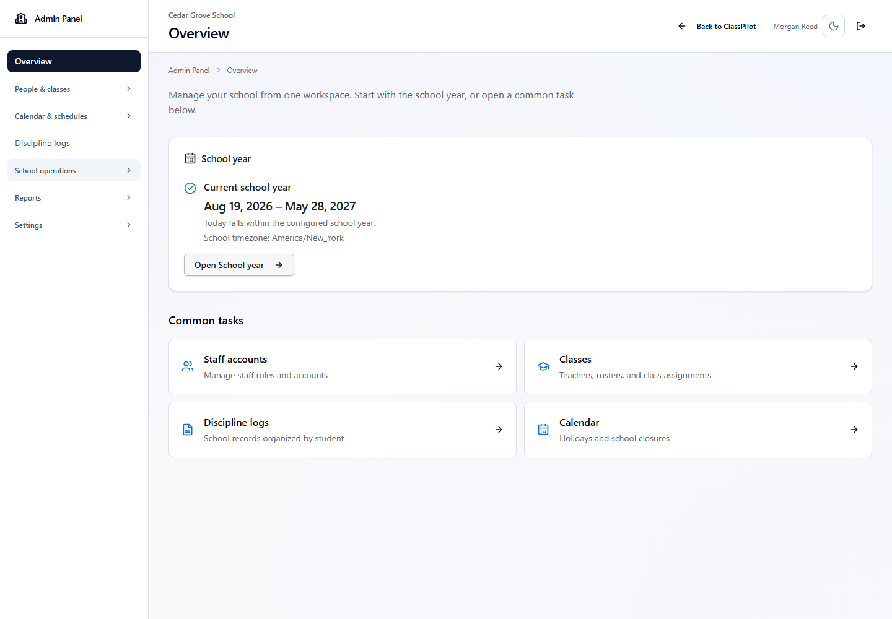
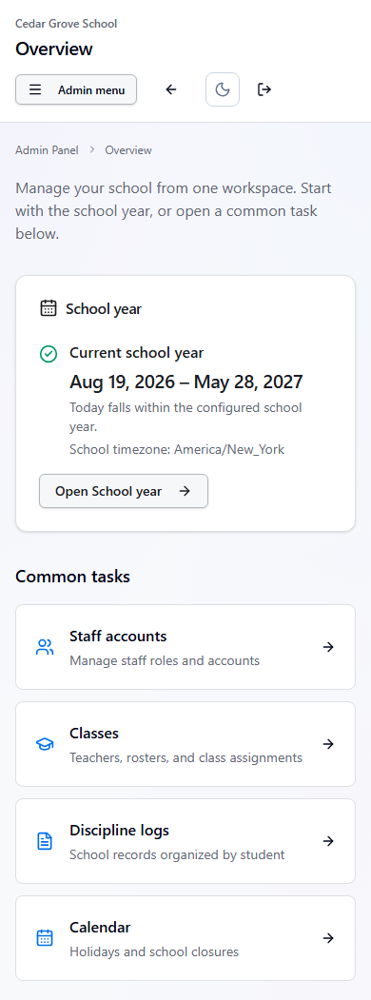
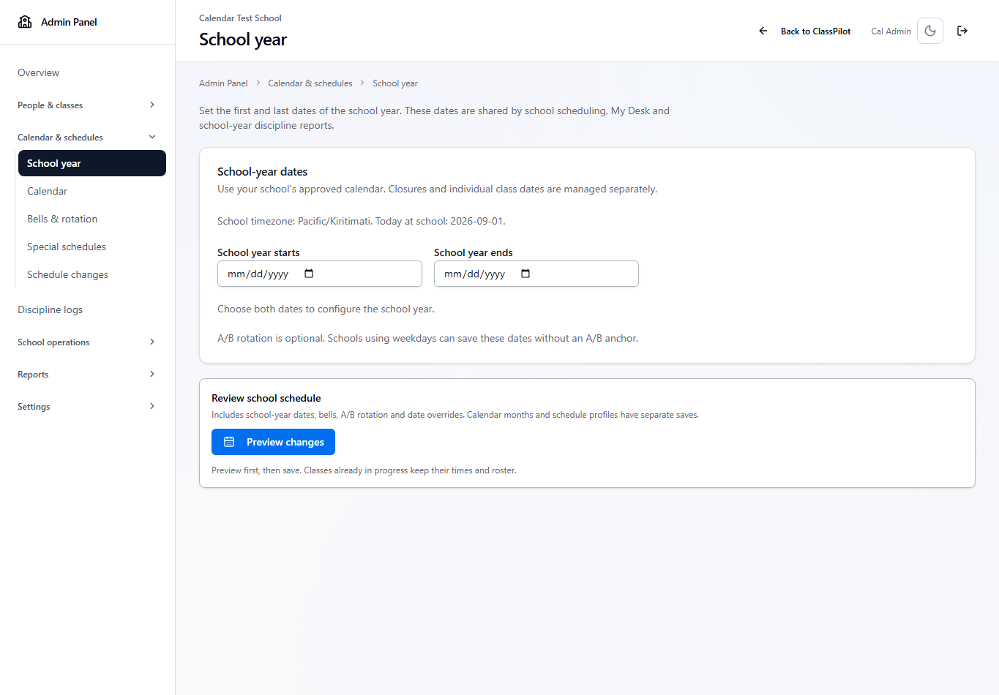
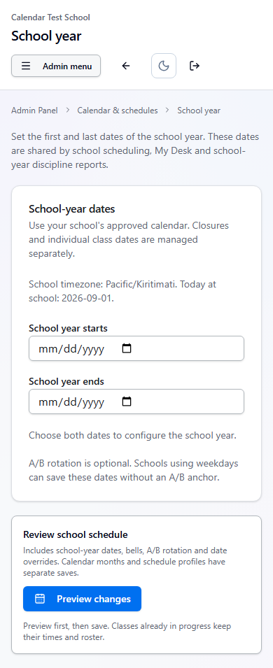
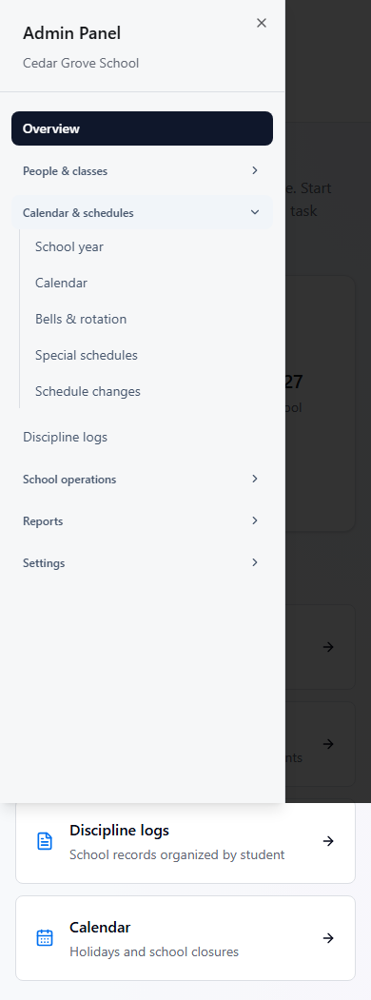

# ClassPilot Admin Panel organization

The Admin Panel opens on Overview. One navigation registry supplies a 240px desktop sidebar and the mobile **Admin menu** drawer. The shell retains ClassPilot authentication and entitlement checks; an `entry=admin` parameter only selects navigation context.

## Destinations

| Section | Pages |
| --- | --- |
| Overview | Saved school-year status and common tasks |
| People & classes | Staff accounts, Students, Classes |
| Calendar & schedules | School year, Calendar, Bells & rotation, Special schedules, Schedule changes |
| Discipline logs | School student summaries and incident history |
| School operations | Active classes, Coverage, Safety Center, entitled Email monitoring |
| Reports | Analytics, Audit logs |
| Settings | School settings, Student portal, Integrations & IT readiness, Admin guide, Maintenance |

School-year dates use the existing scheduling endpoint and preview/revision-checked save. They do not require an A/B anchor unless existing alternating classes require one. Calendar months and special schedule profiles retain their separate save contracts. A scheduling section change preserves drafts; navigating away uses a shared discard guard, and pending writes prevent leaving. Background refreshes cannot erase dirty schedule, calendar, or profile edits.

## Compatibility and ownership

- `/classpilot/admin/scheduling` is canonical and defaults to School year. Old class-scheduling links retain queries, hashes, and router state when redirected.
- Old Admin Calendar links retain their selected month. `admin?tab=students` opens the student directory. Staff, Student portal, and Audit query links continue to work.
- Teacher entry into discipline, contacts, coverage, and paperwork retains the teacher workspace. Admin-origin detail and review links retain their origin. Private Notes and Seating are unchanged.
- School/viewer/access changes dispose editors, abort relevant queries, and remove protected cached admin content. Existing server ownership and shared-record authorization remain authoritative.
- No schema, production configuration, feature flag, AI availability, or deployment change is part of this reorganization.

## Screenshots

These browser fixtures use synthetic staff and school data. The phone images are automated viewport checks, not a real-device acceptance walkthrough.

| Desktop Overview | Phone Overview |
| --- | --- |
|  |  |

| Desktop School year | Phone School year |
| --- | --- |
|  |  |

## Verification

The release-focused suites include the admin shell, nested-operation guards, routing, calendar, scheduling profiles, discipline, contacts, paperwork, coverage, and the existing dashboard/roster/seating regressions. The PR records the exact test results and CI commit. Separate lint/build, API routing/reachability, backend, and governance checks remain required. See [Admin Guide](CLASSPILOT_ADMIN_GUIDE.md) for operating instructions.

This increment is delivered for review. Merging and deploying it require a later operator instruction.
